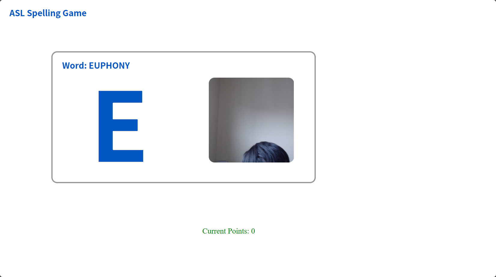

# ASLSpellingGame

This game is a final project of PACSAR-201005, Introduction to Machine Learning and Neural Networks course. By Group 1. <be>

IMPORTANT!: PLEASE USE THIS WITH THE BACKEND API. https://github.com/boypu123/ASLAlphabetDetection

ASL Spelling Game: 
- The game is based on the American Sign Language (ASL) alphabet.
- The game is a spelling game, where the user has to type the letter that is displayed on the screen.
 

## What is it & Why are we doing it?
The sign languages - the unique languages which help disabled people to survive and to strive are being ignored.  
Do you know that sign languages have their language family? Do you know that sign languages are different depending on the country, just like spoken languages?  
The project is a game in which the users can practice the basic alphabet gestures of American Sign Language.  
Sadly, there are still many sign languages that do not have a lot of publicly available datasets.

## Methodology
We used Edge Impulse, a low-code online machine-learning platform, to build a machine-learning model that can recognize the basic alphabet gestures of American Sign Language. We used MobileNet V2 96x96 0.25 because it has the most outstanding performance, ensuring that the model is not overfitting while maintaining accuracy.  

We exported this model and connected it with Node.js to build a web application.  

Then, we used Vue to build the frontend interface.  

For more information, please visit our slideshow: https://1drv.ms/p/s!ArvHrHRaGEvxoZtdbPeyDoEek2oD6Q?e=fyDTrc

## Installation
### Way 1
Download this file and extract it.

### Way 2
Clone this repository using git.  
``git clone git@github.com:boypu123/ASLSpellingGame.git``

## Run

First, run the backend program.  

Then, open another terminal and ``cd frontend`` to the frontend folder. Then run ``npm run dev`` to run the frontend interface. Next, click the link provided.

## Team Members (In Alphabetical Order)
Guoxiang Ran, Southeast University, China; https://github.com/Squincat  
Hongwen Pu, Dulwich College (Singapore), Singapore; https://github.com/boypu123  
Minghua Ying, Southeast University, China; https://github.com/ahuahaha  
Raykio (Keyi) Yi, Dulwich International High School Suzhou, China; https://github.com/Raykxia

## Acknowledgement

Thanks to Professor Rogers from University of Oxford, who had been teaching us throughout this course. It is a pleasure for me to be his student in this course. You can find his GitHub page here: https://github.com/AlexRogersCS, and you can find more about him here: https://www.cs.ox.ac.uk/people/alex.rogers/.
